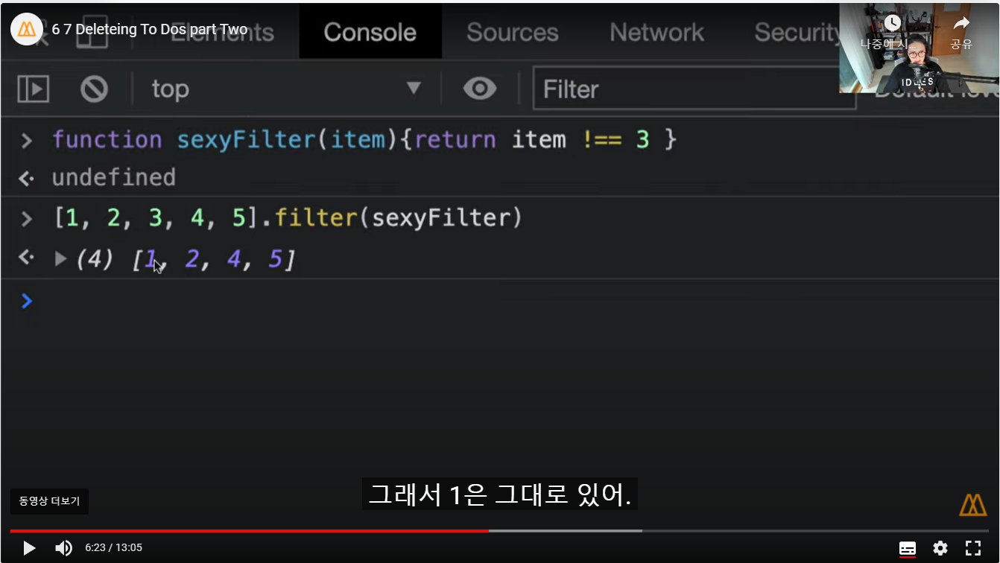
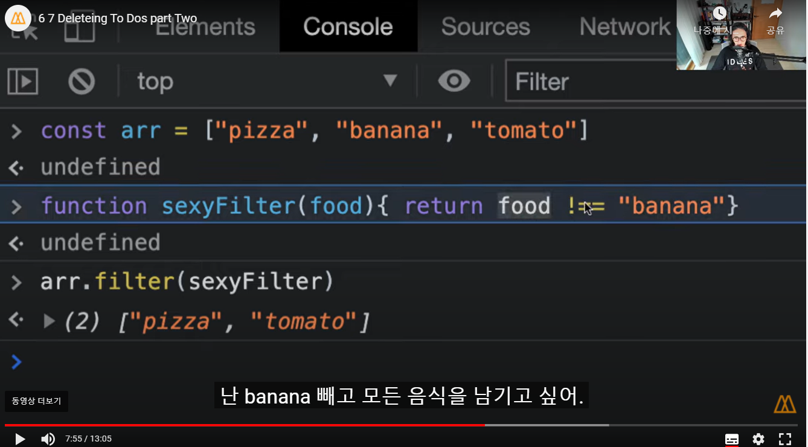
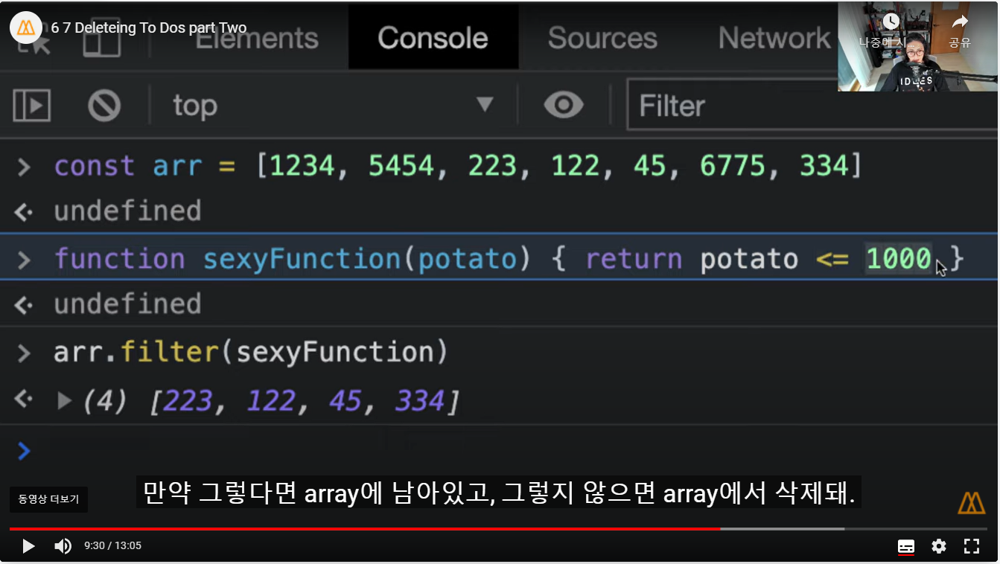
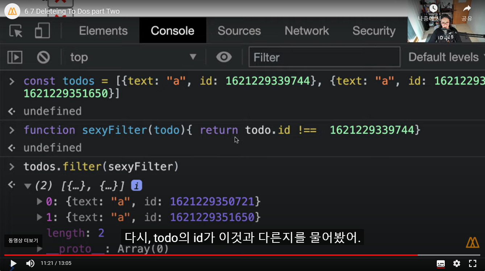
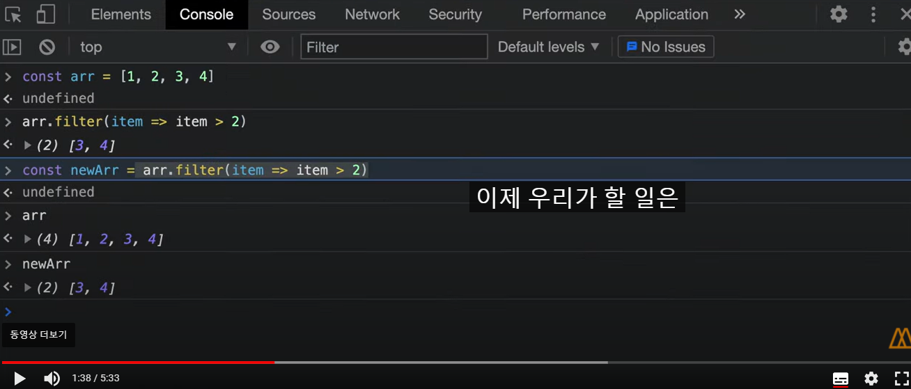
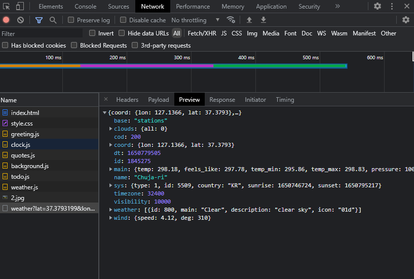
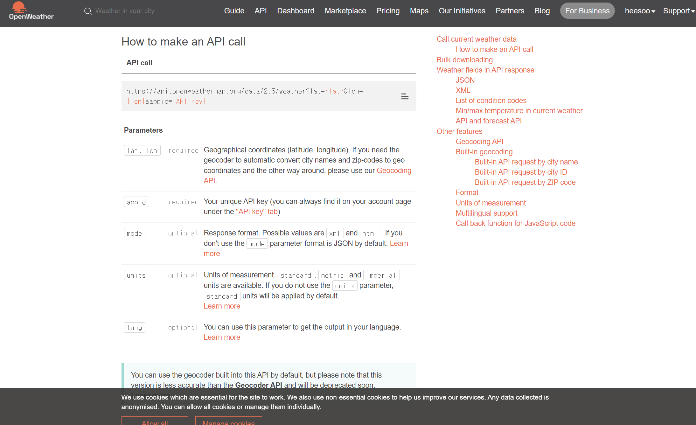

## filter -수업 7.7
* filter에 적용된 함수에서 true만 값으로 반환하고, false는 제외시켜서 새로운 배열을 만든다.!
* filter함수는 기존 array에서 삭제하는게 아니라, 새로운 array를 준다는것이 중요!
* 람다식으로도 가능

## 날씨 API사용
[openweathermap](https://openweathermap.org/api)

* fetch(url)시, js가 url로 요청을 하고 정보를 get해와서 우리가 확인이 가능하다!!!

* 화씨온도 섭씨온도(일반온도)로 바꾸기

